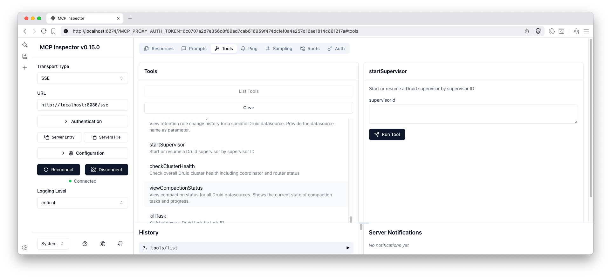
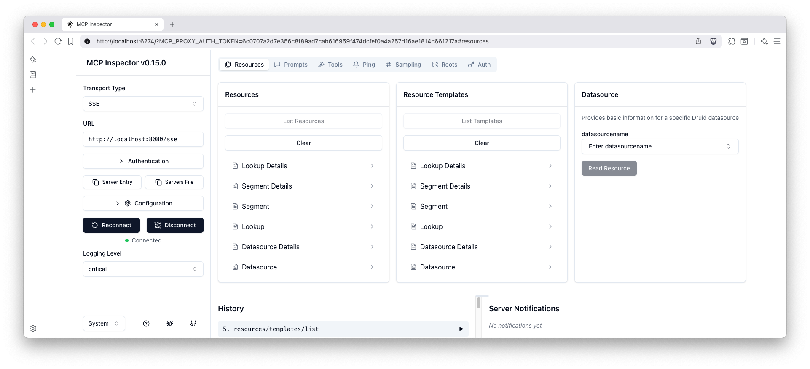
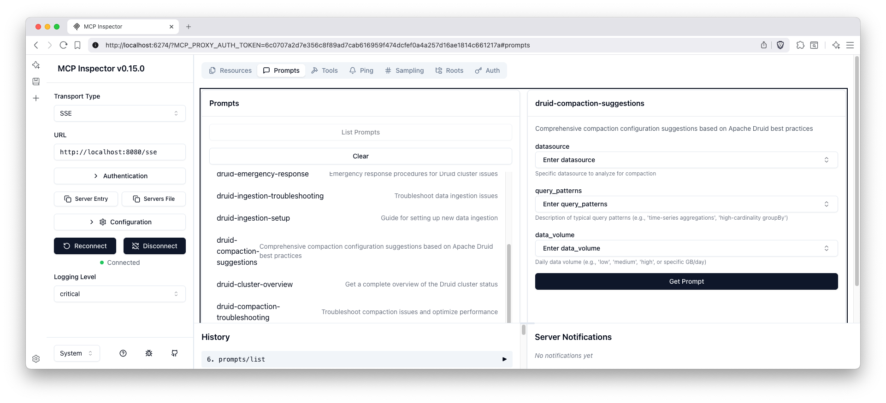

# Druid MCP Server
[](https://archestra.ai/mcp-catalog/iunera__druid-mcp-server)

A comprehensive Model Context Protocol (MCP) server for Apache Druid that provides extensive tools, resources, and prompts for managing and analyzing Druid clusters.

*Developed by [iunera](https://www.iunera.com) - Advanced AI and Data Analytics Solutions*

## Overview

This MCP server implements a feature-based architecture where each package represents a distinct functional area of Druid management. The server provides three main types of MCP components:

- **Tools** - Executable functions for performing operations
- **Resources** - Data providers for accessing information  
- **Prompts** - AI-assisted guidance templates

## Video Walkthrough

Learn how to integrate AI agents with Apache Druid using the MCP server. This tutorial demonstrates time series data exploration, statistical analysis, and data ingestion using natural language with AI assistants like Claude, ChatGPT, and Gemini.

[](https://www.youtube.com/watch?v=BqCEWRZbRjU)

*Click the thumbnail above to watch the video on YouTube*

## Features

- Spring AI MCP Server integration
- Tool-based architecture for MCP protocol compliance
- **Tool-based Architecture**: Complete MCP protocol compliance with automatic JSON schema generation
- **Multiple Transport Modes**: STDIO, SSE, and **Streamable HTTP** support including Oauth
- **Real-time Communication**: Server-Sent Events with streaming capabilities
- Comprehensive error handling
- **Customizable Prompt Templates**: AI-assisted guidance with template customization
- **Comprehensive Error Handling**: Graceful error handling with meaningful responses

### Architecture & Organization
- **Feature-based Package Organization**: Each package represents a distinct Druid management area
- **Auto-discovery**: Automatic registration of tools, resources, and prompts via annotations
- **Enterprise Ready**: Production-grade configuration and security features


### MCP Inspector Interface

When connected to an MCP client, you can inspect the available tools, resources, and prompts through the MCP inspector interface:

#### Available Tools


The tools interface shows all available Druid management functions organized by feature areas including data management, ingestion management, and monitoring & health.

#### Available Resources


The resources interface displays all accessible Druid data sources and metadata that can be retrieved through the MCP protocol.

#### Available Prompts


The prompts interface shows all AI-assisted guidance templates available for various Druid management tasks and data analysis workflows.

## Quick Start

### MCP Configuration for LLMs

A ready-to-use MCP configuration file is provided at `mcp-servers-config.json` that can be used with LLM clients to connect to this Druid MCP server.

#### Examples
The configuration includes both transport options:

* [STDIO default)](examples/stdio/README.md) (: see examples/stdio/README.md - server is spawned by the MCP client over STDIO.
* [Streamable HTTP (profile: http)](examples/streamable-http/README.md) : see examples/streamable-http/README.md - single /mcp endpoint per MCP 2025-06-18.


#### Docker examples using environment variables:

```bash
# STDIO mode (default)
docker run --rm -i \
  -e DRUID_ROUTER_URL=http://your-druid-router:8888 \
  -e DRUID_COORDINATOR_URL=http://your-druid-coordinator:8081 \
  iunera/druid-mcp-server:latest

# HTTP mode (enable profile 'http' and expose /mcp)
docker run -p 8080:8080 \
  -e SPRING_PROFILES_ACTIVE=http \
  -e DRUID_ROUTER_URL=http://your-druid-router:8888 \
  -e DRUID_COORDINATOR_URL=http://your-druid-coordinator:8081 \
  iunera/druid-mcp-server:latest
```

Note on Spring profiles:
- Default profile: stdio (no SPRING_PROFILES_ACTIVE needed)
- HTTP profile: set SPRING_PROFILES_ACTIVE=http to enable Streamable HTTP at /mcp

### Prerequisites
- Java 24
- Maven 3.6+
- Apache Druid cluster running with router on port 8888

### Build and Run
```bash
# Build the application
mvn clean package -DskipTests

# Run the application
java -jar target/druid-mcp-server-1.6.0.jar
```

The server will start on port 8080 by default.

For detailed build instructions, testing, Docker setup, and development guidelines, see [development.md](development.md).

## Security & Authentication

- Streamable HTTP and SSE transports are secured with OAuth 2.0 by default.
- Clients must send a valid Bearer token in the Authorization header when connecting.
- Example: Authorization: Bearer YOUR_JWT_TOKEN

### Environment Variables

*   `DRUID_MCP_SECURITY_OAUTH2_ENABLED`:
    *   **Description:** Enables or disables OAuth2 security for client authentication.
    *   **Type:** Boolean
    *   **Default:** `true` (OAuth2 is enabled by default as per the text above)
    *   **Usage:** Set to `false` to disable OAuth2 authentication. When disabled, clients can access the server without providing OAuth2 tokens.
- For enterprise SSO integration (OpenID Connect, Azure AD, Keycloak, etc.), please send an inquiry to [consulting@iunera.com](mailto:consulting@iunera.com?subject=Druid%20MCP%20Server%20SSO%20integration) and see [Contact & Support](#contact--support).

## Installation from Maven Central

If you prefer to use the pre-built JAR without building from source, you can download and run it directly from Maven Central.

### Prerequisites
- Java 24 JRE only

### Download and Run

Download the JAR from Maven Central https://repo.maven.apache.org/maven2/com/iunera/druid-mcp-server/

```bash
# STDIO mode (default)
java -jar target/druid-mcp-server-1.6.0.jar

# HTTP mode (profile: http) - exposes /mcp on port 8080
java -Dspring.profiles.active=http \
     -jar target/druid-mcp-server-1.6.0.jar
```

## For Developers

For detailed development information including build instructions, testing guidelines, architecture details, and contributing guidelines, see [development.md](development.md).

## Available Tools by Feature

The MCP server auto-discovers all tools via annotations. In Read-only mode, any tool that would modify the Druid cluster is not registered and will not appear in the MCP client. The lists below reflect the current implementation.

### Data Management

| Feature | Tool | Description | Parameters |
|---------|------|-------------|------------|
| **Datasource** | `listDatasources` | List all available Druid datasource names | None |
| **Datasource** | `showDatasourceDetails` | Show detailed information for a specific datasource including column information | `datasourceName` (String) |
| **Datasource** | `killDatasource` | Kill a datasource permanently, removing all data and metadata | `datasourceName` (String), `interval` (String) |
| **Lookup** | `listLookups` | List all available Druid lookups from the coordinator | None |
| **Lookup** | `getLookupConfig` | Get configuration for a specific lookup | `tier` (String), `lookupName` (String) |
| **Lookup** | `updateLookupConfig` | Update configuration for a specific lookup | `tier` (String), `lookupName` (String), `config` (String) |
| **Segments** | `listAllSegments` | List all segments across all datasources | None |
| **Segments** | `getSegmentMetadata` | Get metadata for specific segments | `datasourceName` (String), `segmentId` (String) |
| **Segments** | `getSegmentsForDatasource` | Get all segments for a specific datasource | `datasourceName` (String) |
| **Query** | `queryDruidSql` | Execute a SQL query against Druid datasources | `sqlQuery` (String) |
| **Retention** | `viewRetentionRules` | View retention rules for all datasources or a specific one | `datasourceName` (String, optional) |
| **Retention** | `updateRetentionRules` | Update retention rules for a datasource | `datasourceName` (String), `rules` (String) |
| **Compaction** | `viewAllCompactionConfigs` | View compaction configurations for all datasources | None |
| **Compaction** | `viewCompactionConfigForDatasource` | View compaction configuration for a specific datasource | `datasourceName` (String) |
| **Compaction** | `editCompactionConfigForDatasource` | Edit compaction configuration for a datasource | `datasourceName` (String), `config` (String) |
| **Compaction** | `deleteCompactionConfigForDatasource` | Delete compaction configuration for a datasource | `datasourceName` (String) |
| **Compaction** | `viewCompactionStatus` | View compaction status for all datasources | None |
| **Compaction** | `viewCompactionStatusForDatasource` | View compaction status for a specific datasource | `datasourceName` (String) |

### Ingestion Management

| Feature | Tool | Description | Parameters |
|---------|------|-------------|------------|
| **Ingestion Spec** | `createBatchIngestionTemplate` | Create a batch ingestion template | `datasourceName` (String), `inputSource` (String), `timestampColumn` (String) |
| **Ingestion Spec** | `createIngestionSpec` | Create and submit an ingestion specification | `specJson` (String) |
| **Supervisors** | `listSupervisors` | List all streaming ingestion supervisors | None |
| **Supervisors** | `getSupervisorStatus` | Get status of a specific supervisor | `supervisorId` (String) |
| **Supervisors** | `suspendSupervisor` | Suspend a streaming supervisor | `supervisorId` (String) |
| **Supervisors** | `startSupervisor` | Start or resume a streaming supervisor | `supervisorId` (String) |
| **Supervisors** | `terminateSupervisor` | Terminate a streaming supervisor | `supervisorId` (String) |
| **Tasks** | `listTasks` | List all ingestion tasks | None |
| **Tasks** | `getTaskStatus` | Get status of a specific task | `taskId` (String) |
| **Tasks** | `shutdownTask` | Shutdown a running task | `taskId` (String) |

### Monitoring & Health

| Feature | Tool | Description | Parameters |
|---------|------|-------------|------------|
| **Basic Health** | `checkClusterHealth` | Check overall cluster health status | None |
| **Basic Health** | `getServiceStatus` | Get status of specific Druid services | `serviceType` (String) |
| **Basic Health** | `getClusterConfiguration` | Get cluster configuration information | None |
| **Diagnostics** | `runDruidDoctor` | Run comprehensive cluster diagnostics | None |
| **Diagnostics** | `analyzePerformanceIssues` | Analyze cluster performance issues | None |
| **Diagnostics** | `generateHealthReport` | Generate detailed health report | None |
| **Functionality** | `testQueryFunctionality` | Test query functionality across services | None |
| **Functionality** | `testIngestionFunctionality` | Test ingestion functionality | None |
| **Functionality** | `validateClusterConnectivity` | Validate connectivity between cluster components | None |

### Basic Security

| Feature | Tool | Description | Parameters |
|---------|------|-------------|------------|
| **Authentication** | `listAuthenticationUsers` | List all users in the Druid authentication system for a specific authenticator | `authenticatorName` (String) |
| **Authentication** | `getAuthenticationUser` | Get details of a specific user from the Druid authentication system | `authenticatorName` (String), `userName` (String) |
| **Authentication** | `createAuthenticationUser` | Create a new user in the Druid authentication system | `authenticatorName` (String), `userName` (String) |
| **Authentication** | `deleteAuthenticationUser` | Delete a user from the Druid authentication system. Use with caution as this action cannot be undone. | `authenticatorName` (String), `userName` (String) |
| **Authentication** | `setUserPassword` | Set or update the password for a user in the Druid authentication system | `authenticatorName` (String), `userName` (String), `password` (String) |
| **Authorization** | `listAuthorizationUsers` | List all users in the Druid authorization system for a specific authorizer | `authorizerName` (String) |
| **Authorization** | `getAuthorizationUser` | Get details of a specific user from the Druid authorization system including their roles | `authorizerName` (String), `userName` (String) |
| **Authorization** | `listRoles` | List all roles in the Druid authorization system for a specific authorizer | `authorizerName` (String) |
| **Authorization** | `getRole` | Get details of a specific role from the Druid authorization system including its permissions | `authorizerName` (String), `roleName` (String) |
| **Authorization** | `createAuthorizationUser` | Create a new user in the Druid authorization system | `authorizerName` (String), `userName` (String) |
| **Authorization** | `deleteAuthorizationUser` | Delete a user from the Druid authorization system. Use with caution as this action cannot be undone. | `authorizerName` (String), `userName` (String) |
| **Authorization** | `createRole` | Create a new role in the Druid authorization system | `authorizerName` (String), `roleName` (String) |
| **Authorization** | `deleteRole` | Delete a role from the Druid authorization system. Use with caution as this action cannot be undone. | `authorizerName` (String), `roleName` (String) |
| **Authorization** | `setRolePermissions` | Set permissions for a role in the Druid authorization system. Provide permissions as JSON array. | `authorizerName` (String), `roleName` (String), `permissions` (String) |
| **Authorization** | `assignRoleToUser` | Assign a role to a user in the Druid authorization system | `authorizerName` (String), `userName` (String), `roleName` (String) |
| **Authorization** | `unassignRoleFromUser` | Unassign a role from a user in the Druid authorization system | `authorizerName` (String), `userName` (String), `roleName` (String) |
| **Configuration** | `getAuthenticatorChainAndAuthorizers` | Get configured authenticatorChain and authorizers form the Basic Auth configuration. This information is important for any other security tool and LLMs need to call this tool first. | None |

## Available Resources by Feature

| Feature | Resource URI Pattern | Description | Parameters |
|---------|---------------------|-------------|------------|
| **Datasource** | `druid://datasource/{datasourceName}` | Access datasource information and metadata | `datasourceName` (String) |
| **Datasource** | `druid://datasource/{datasourceName}/details` | Access detailed datasource information including schema | `datasourceName` (String) |
| **Lookup** | `druid://lookup/{tier}/{lookupName}` | Access lookup configuration and data | `tier` (String), `lookupName` (String) |
| **Segments** | `druid://segment/{segmentId}` | Access segment metadata and information | `segmentId` (String) |

## Available Prompts by Feature

| Feature | Prompt Name | Description | Parameters |
|---------|-------------|-------------|------------|
| **Data Analysis** | `data-exploration` | Guide for exploring data in Druid datasources | `datasource` (String, optional) |
| **Data Analysis** | `query-optimization` | Help optimize Druid SQL queries for better performance | `query` (String) |
| **Cluster Management** | `health-check` | Comprehensive cluster health assessment guidance | None |
| **Cluster Management** | `cluster-overview` | Overview and analysis of cluster status | None |
| **Ingestion Management** | `ingestion-troubleshooting` | Troubleshoot ingestion issues | `issue` (String, optional) |
| **Ingestion Management** | `ingestion-setup` | Guide for setting up new ingestion pipelines | `dataSource` (String, optional) |
| **Retention Management** | `retention-management` | Manage data retention policies | `datasource` (String, optional) |
| **Compaction** | `compaction-suggestions` | Optimize segment compaction configuration | `datasource` (String, optional), `currentConfig` (String, optional), `performanceMetrics` (String, optional) |
| **Compaction** | `compaction-troubleshooting` | Troubleshoot compaction issues | `issue` (String), `datasource` (String, optional) |
| **Operations** | `emergency-response` | Emergency response procedures and guidance | None |
| **Operations** | `maintenance-mode` | Cluster maintenance procedures | None |

### Environment Variables Configuration

The application can be configured using environment variables, which is the recommended approach for production environments. Below is a comprehensive list of supported environment variables derived from the `application.yaml` configuration file.

#### Druid Connection
- `DRUID_ROUTER_URL`: The URL of the Druid router.
- `DRUID_AUTH_USERNAME`: The username for Druid authentication.
- `DRUID_AUTH_PASSWORD`: The password for Druid authentication.
- `DRUID_SSL_ENABLED`: Enables or disables SSL for Druid connections (true/false).
- `DRUID_SSL_SKIP_VERIFICATION`: Skips SSL certificate verification (true/false).

#### MCP Server Configuration
- `DRUID_MCP_SECURITY_OAUTH2_ENABLED`: Enables or disables OAuth2 security for client authentication (true/false).
- `DRUID_MCP_READONLY_ENABLED`: Enables or disables read-only mode (true/false).
- `DRUID_EXTENSION_DRUID_BASIC_SECURITY_ENABLED`: Enables or disables the basic security feature (true/false). When disabled, basic security tools are not registered.
- `SPRING_AI_MCP_SERVER_NAME`: The name of the MCP server.
- `SPRING_AI_MCP_SERVER_PROTOCOL`: The protocol used by the MCP server (e.g., `streamable`).

#### General Server Configuration
- `SERVER_PORT`: The port the server listens on.
- `SERVER_SERVLET_SESSION_COOKIE_NAME`: The name of the session cookie.
- `SPRING_APPLICATION_NAME`: The name of the application.
- `SPRING_CONFIG_IMPORT`: Imports additional configuration files.
- `SPRING_MAIN_BANNER_MODE`: The mode for the startup banner (e.g., `off`).

#### Logging
- `LOGGING_FILE_NAME`: The name of the log file.
- `LOGGING_LEVEL_ORG_SPRINGFRAMEWORK_SECURITY`: The log level for Spring Security (e.g., `DEBUG`).


### SSL-Encrypted Cluster with Authentication

This section provides comprehensive guidance on connecting to SSL-encrypted Druid clusters with username and password authentication.

#### Prerequisites

- SSL-enabled Druid cluster with HTTPS endpoints
- Valid username and password credentials for Druid authentication
- SSL certificates properly configured (or ability to skip verification for testing)

#### Configuration Methods

##### Method 1: Environment Variables (Recommended for Production)

Set the following environment variables before starting the MCP server:

```bash
# Druid cluster URL with HTTPS
export DRUID_ROUTER_URL="https://your-druid-cluster.example.com:8888"

# Authentication credentials
export DRUID_AUTH_USERNAME="your-username"
export DRUID_AUTH_PASSWORD="your-password"

# SSL configuration
export DRUID_SSL_ENABLED="true"
export DRUID_SSL_SKIP_VERIFICATION="false"  # Use "true" only for testing

# Start the MCP server
java -jar target/druid-mcp-server-1.6.0.jar
```

##### Method 2: Runtime System Properties

Pass configuration as JVM system properties:

```bash
java -Ddruid.router.url="http://localhost:8888" \
     -Ddruid.auth.username="admin" \
     -Ddruid.auth.password="password" \
     -jar target/druid-mcp-server-1.6.0.jar
```

#### SSL Configuration Options

##### Production SSL Setup

For production environments with valid SSL certificates:

```bash
export DRUID_ROUTER_URL="https://druid-prod.company.com:8888"
export DRUID_SSL_ENABLED="true"
export DRUID_SSL_SKIP_VERIFICATION="false"
```

The server will use the system's default truststore to validate SSL certificates.

#### Authentication Methods

The MCP server supports HTTP Basic Authentication with username and password:

- **Username**: Set via `DRUID_AUTH_USERNAME` or `druid.auth.username`
- **Password**: Set via `DRUID_AUTH_PASSWORD` or `druid.auth.password`

The credentials are automatically encoded using Base64 and sent with each request using the `Authorization: Basic` header.

##### MCP Client Configuration with SSL

Update your `mcp-servers-config.json` to include environment variables:

```json
{
  "mcpServers": {
    "druid-mcp-server": {
      "command": "docker",
      "args": [
        "run",
        "--rm",
        "-i",
        "-e",
        "DRUID_ROUTER_URL",
        "-e",
        "DRUID_COORDINATOR_URL",
        "-e",
        "DRUID_AUTH_USERNAME",
        "-e",
        "DRUID_AUTH_PASSWORD",
        "-e",
        "DRUID_SSL_ENABLED",
        "-e",
        "DRUID_SSL_SKIP_VERIFICATION",
        "-e",
        "DRUID_MCP_READONLY_ENABLED",
        "iunera/druid-mcp-server:1.6.0"
      ],
      "env": {
        "DRUID_ROUTER_URL": "http://host.docker.internal:8888",
        "DRUID_COORDINATOR_URL": "http://host.docker.internal:8081",
        "DRUID_AUTH_USERNAME": "",
        "DRUID_AUTH_PASSWORD": "",
        "DRUID_SSL_ENABLED": "false",
        "DRUID_SSL_SKIP_VERIFICATION": "true",
        "DRUID_MCP_READONLY_ENABLED": "false"
      }
    }
  }
}
```

## MCP Prompt Customization

The server provides extensive prompt customization capabilities through the `prompts.properties` file located in `src/main/resources/`.

### Prompt Configuration Structure

The prompts.properties file contains:

1. **Global Settings**: Enable/disable prompts and set watermarks
2. **Feature Toggles**: Control which prompts are available
3. **Custom Variables**: Organization-specific information
4. **Template Definitions**: Full prompt templates for each feature

### Overriding Prompts

You can override any prompt template using Java system properties with the `-D` flag:

#### Method 1: System Properties (Runtime Override)

```bash
java -Dprompts.druid-data-exploration.template="Your custom template here" \
     -jar target/druid-mcp-server-1.6.0.jar
```

#### Method 2: Custom Properties File

1. Create a custom properties file (e.g., `custom-prompts.properties`):
```properties
# Custom prompt template
prompts.druid-data-exploration.template=My custom data exploration prompt:\n\
1. Custom step one\n\
2. Custom step two\n\
{datasource_section}\n\
Environment: {environment}
```

2. Load it at runtime:
```bash
java -Dspring.config.additional-location=classpath:custom-prompts.properties \
     -jar target/druid-mcp-server-1.6.0.jar
```

### Available Prompt Variables

All prompt templates support these variables:

| Variable | Description | Example |
|----------|-------------|---------|
| `{environment}` | Current environment name | `production`, `staging`, `dev` |
| `{organizationName}` | Organization name | `Your Organization` |
| `{contactInfo}` | Contact information | `your-team@company.com` |
| `{watermark}` | Generated watermark | `Generated by Druid MCP Server v1.0.0` |
| `{datasource}` | Datasource name (context-specific) | `sales_data` |
| `{query}` | SQL query (context-specific) | `SELECT * FROM sales_data` |

### Prompt Template Examples

#### Custom Data Exploration Prompt
```properties
prompts.druid-data-exploration.template=Welcome to {organizationName} Druid Analysis!\n\n\
Please help me explore our data:\n\
{datasource_section}\n\
Environment: {environment}\n\
Contact: {contactInfo}\n\n\
{watermark}
```

#### Custom Query Optimization Prompt
```properties
prompts.druid-query-optimization.template=Query Performance Analysis for {organizationName}\n\n\
Query to optimize: {query}\n\n\
Please provide:\n\
1. Performance bottleneck analysis\n\
2. Optimization recommendations\n\
3. Best practices for our {environment} environment\n\n\
{watermark}
```

### Disabling Specific Prompts

You can disable individual prompts by setting their enabled flag to false:

```properties
mcp.prompts.data-exploration.enabled=false
mcp.prompts.query-optimization.enabled=false
```

Or disable all prompts globally:
```properties
mcp.prompts.enabled=false
```

## MCP Integration

This server uses Spring AI's MCP Server framework and supports both STDIO and SSE transports. The tools, resources, and prompts are automatically registered and exposed through the MCP protocol.

### Transport Modes

The Druid MCP Server supports multiple transport modes compliant with MCP 2025-06-18 specification:

#### Streamable HTTP Transport (Recommended)
The new **Streamable HTTP** transport provides enhanced performance and scalability with support for multiple concurrent clients:

```bash
# Default configuration with Streamable HTTP

java -Dspring.profiles.active=http \
     -jar target/druid-mcp-server-1.6.0.jar
# Server available at http://localhost:8080/mcp (configurable endpoint)
```

**Features:**
- **Single Endpoint**: One HTTP endpoint handles both POST and GET requests
- **Multiple Clients**: Support for concurrent client connections
- **Optional SSE Streaming**: Server-Sent Events for real-time updates
- **Enhanced Security**: Origin header validation and authentication
- **Backwards Compatibility**: Automatic fallback for older MCP clients
- **Keep-alive**: Configurable connection health monitoring

Security
- The Streamable HTTP and SSE modes are secured with OAuth by default. Your MCP client must obtain and send a valid bearer token when connecting.
- For enterprise SSO integration (OpenID Connect, Azure AD, Keycloak, etc.), please send an inquiry to [consulting@iunera.com](mailto:consulting@iunera.com?subject=Druid%20MCP%20Server%20SSO%20integration) and see [Contact & Support](#contact--support).

#### STDIO Transport (Command-line Integration)
Perfect for LLM clients and desktop applications:

```bash
java -jar target/druid-mcp-server-1.6.0.jar
```

#### Legacy SSE Transport (Deprecated)
Still supported for backwards compatibility. It is no longer the default and may be removed in a future version.

Note: The SSE endpoint is secured with OAuth by default. Clients must include a valid bearer token when connecting. For SSO integration support, see [Contact & Support](#contact--support).


### Read-only Mode

Read-only mode prevents any operation that could mutate your Druid cluster while still allowing safe read operations and SQL queries. When enabled:
- All HTTP GET requests are allowed
- HTTP POST is allowed only to the exact path /druid/v2/sql (for SELECT and other read-only SQL)
- Any other HTTP method (PUT, PATCH, DELETE) is blocked
- Any other POST endpoint (e.g. ingestion/task endpoints) is blocked
- MCP write tools are not registered, so they will not appear in your MCP client’s tool list

#### Enable Read-only Mode
You can enable it using any of the following methods:

1) application.properties

```
druid.mcp.readonly.enabled=true
```

2) Environment variable

```bash
export DRUID_MCP_READONLY_ENABLED=true
```

3) JVM system property

```bash
java -Ddruid.mcp.readonly.enabled=true -jar target/druid-mcp-server-1.6.0.jar
```

4) Docker

```bash
docker run --rm -p 8080:8080 \
  -e DRUID_MCP_READONLY_ENABLED=true \
  iunera/druid-mcp-server:latest
```

### What changes in read-only mode?
- Tools that would modify the cluster are disabled and won’t be listed by the MCP client. Examples include:
    - Segment state changes (enableSegment, disableSegment)
    - Datasource deletion (killDatasource)
    - Retention rule edits (editRetentionRulesForDatasource)
    - Compaction config edits (editCompactionConfigForDatasource, deleteCompactionConfigForDatasource)
    - Lookup changes (createOrUpdateLookup, deleteLookup)
    - Supervisor control (suspendSupervisor, startSupervisor, terminateSupervisor)
    - Task control (killTask)
    - Multi-stage SQL task operations (queryDruidMultiStage, queryDruidMultiStageWithContext, getMultiStageQueryTaskStatus, cancelMultiStageQueryTask)
    - Ingestion spec submission and templates (createIngestionSpec, createBatchIngestionTemplate)
    - Basic security changing tools (e.g., `createAuthenticationUser`, `deleteAuthenticationUser`, `setUserPassword`, `createAuthorizationUser`, `deleteAuthorizationUser`, `createRole`, `deleteRole`, `setRolePermissions`, `assignRoleToUser`, `unassignRoleFromUser`)
- Read-only-safe tools remain available, including SQL queries (queryDruidSql), metadata and status lookups, health diagnostics, task and segment inspection, etc.


## Metrics Collection

To enhance the product and understand usage patterns, this server collects anonymous usage metrics. This data helps prioritize new features and improvements. You can opt-out of anonymous metrics collection by setting the `druid.mcp.metrics.enabled` to `false.

### 🐳 [Druid Cluster Setup](examples/druidcluster/README.md)
Complete Docker Compose configuration for running a full Apache Druid cluster locally. Perfect for development, testing, and learning about Druid cluster architecture.

**Features:**
- Full Druid cluster with all components (Coordinator, Broker, Historical, MiddleManager, Router)
- PostgreSQL metadata storage and ZooKeeper coordination
- Pre-configured with sample data and ingestion examples
- Integrated Druid MCP Server for immediate testing

~~## Related Projects

This Druid MCP Server is part of a comprehensive ecosystem of Apache Druid tools and extensions developed by iunera. These complementary projects enhance different aspects of Druid cluster management and data ingestion:

### 🔧 [Druid Cluster Configuration](https://github.com/iunera/druid-cluster-config)
Advanced configuration management and deployment tools for Apache Druid clusters. This project provides:

- **Automated Cluster Setup**: Streamlined configuration templates for different deployment scenarios
- **Configuration Management**: Best practices and templates for production Druid clusters
- **Deployment Automation**: Tools and scripts for consistent cluster deployments
- **Environment-Specific Configs**: Optimized configurations for development, staging, and production environments

**Integration with Druid MCP Server**: The cluster configurations provided by this project work seamlessly with the monitoring and management capabilities of the Druid MCP Server, enabling comprehensive cluster lifecycle management.

### 📊 [Code Ingestion Druid Extension](https://github.com/iunera/iu-code-ingestion-druid-extension)
A specialized Apache Druid extension for ingesting and analyzing code-related data and metrics. This extension enables:

- **Code Metrics Ingestion**: Specialized parsers for code analysis data and software metrics
- **Developer Analytics**: Tools for analyzing code quality, complexity, and development patterns
- **CI/CD Integration**: Seamless integration with continuous integration and deployment pipelines
- **Custom Data Formats**: Support for various code analysis tools and formats

**Integration with Druid MCP Server**: This extension expands the ingestion capabilities that can be managed through the MCP server's ingestion management tools, providing specialized support for code analytics use cases.

### Why Use These Together?

- **Complete Ecosystem**: From cluster setup to specialized data ingestion and management
- **Consistent Architecture**: All projects follow similar design principles and integration patterns
- **Enhanced Capabilities**: Each project extends different aspects of the Druid ecosystem
- **Production Ready**: Battle-tested configurations and extensions for enterprise deployments

## Roadmap

- **Druid Auto Compaction**: Intelligent automatic compaction configuration
- **MCP Auto Completion**: Enhanced autocomplete functionality with sampling using McpComplete
- **MCP Notifications**: Real-time notifications for MCP operations
- **Proper Observability**: Comprehensive metrics and tracing
- **Enhanced Monitoring**: Advanced cluster monitoring and alerting capabilities
- **Advanced Analytics**: Machine learning-powered insights and recommendations
- **Kubernetes Support**: Proper deployment on Kubernetes

---

## About iunera

This Druid MCP Server is developed and maintained by **[iunera](https://www.iunera.com)**, a leading provider of advanced AI and data analytics solutions. 

iunera specializes in:
- **AI-Powered Analytics**: Cutting-edge artificial intelligence solutions for data analysis
- **Enterprise Data Platforms**: Scalable data infrastructure and analytics platforms (Druid, Flink, Kubernetes, Kafka, Spring)
- **Model Context Protocol (MCP) Solutions**: Advanced MCP server implementations for various data systems
- **Custom AI Development**: Tailored AI solutions for enterprise needs

As veterans in Apache Druid iunera deployed and maintained a large number of solutions based on [Apache Druid](https://druid.apache.org/) in productive enterprise grade scenarios. 

### Need Expert Apache Druid Consulting?

**Maximize your return on data** with professional Druid implementation and optimization services. From architecture design to performance tuning and AI integration, our experts help you navigate Druid's complexity and unlock its full potential.

**[Get Expert Druid Consulting →](https://www.iunera.com/apache-druid-ai-consulting-europe/)**

### Need Enterprise MCP Server Development Consulting?

**ENTERPRISE AI INTEGRATION & CUSTOM MCP (MODEL CONTEXT PROTOCOL) SERVER DEVELOPMENT**

Iunera specializes in developing production-grade AI agents and enterprise-grade LLM solutions, helping businesses move beyond generic AI chatbots. They build secure, scalable, and future-ready AI infrastructure, underpinned by the Model Context Protocol (MCP), to connect proprietary data, legacy systems, and external APIs to advanced AI models.

**[Get Enterprise MCP Server Development Consulting →](https://www.iunera.com/enterprise-mcp-server-development/)**

For more information about our services and solutions, visit [www.iunera.com](https://www.iunera.com).

### Contact & Support

Need help? Let 

- **Website**: [https://www.iunera.com](https://www.iunera.com)
- **Professional Services**: Contact us through [email](mailto:consulting@iunera.com?subject=Druid%20MCP%20Server%20inquiry) for [Apache Druid enterprise consulting, support and custom development](https://www.iunera.com/apache-druid-ai-consulting-europe/)
- **Open Source**: This project is open source and community contributions are welcome

---

*© 2024 [iunera](https://www.iunera.com). Licensed under the Apache License 2.0.*
